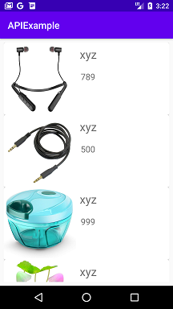

# API Example
Projeto desenvolvido no curso "Desenvolvimento Integrado de aplicativos Android" do bootcamp everis Kotlin Developer da [Digital Innovation One](https://digitalinnovation.one).

Este aplicativo faz requisições de API com o auxílio da biblioteca Retrofit, um cliente HTTP para Android, para obter dados de produtos. Em seguida, o aplicativo cria uma Recycler View usando os dados obtidos.

## Instruções
Faça o clone ou download do repositório e execute o aplicativo no Android Studio.

## Screenshots
